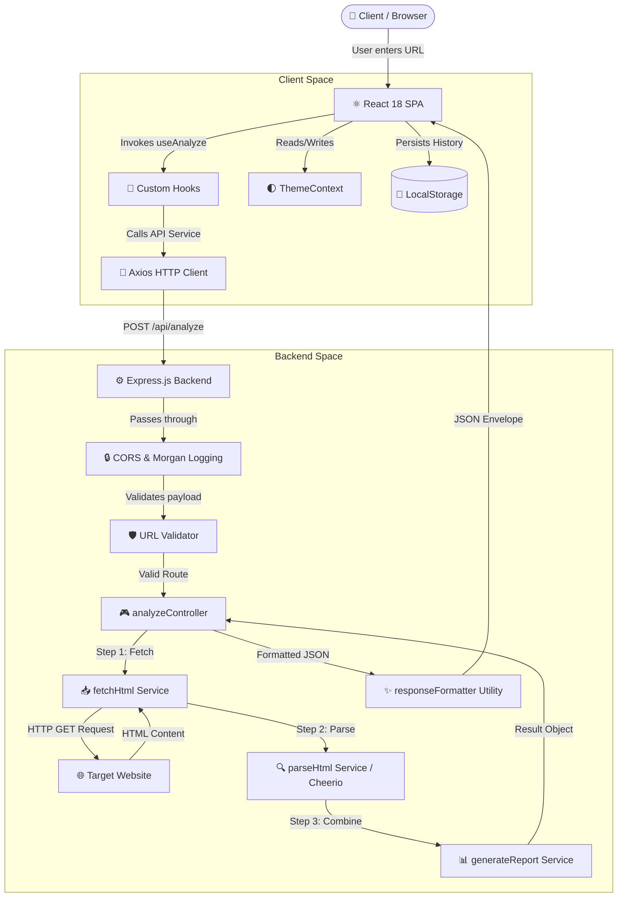
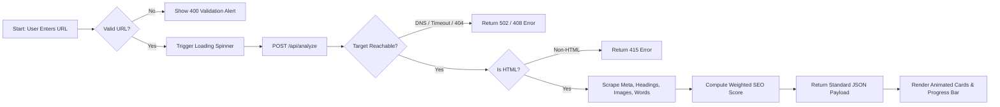
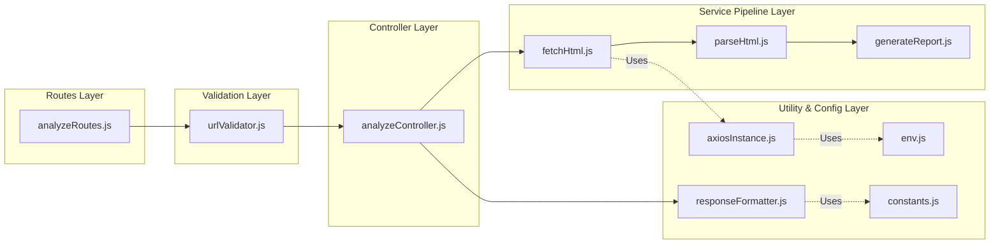
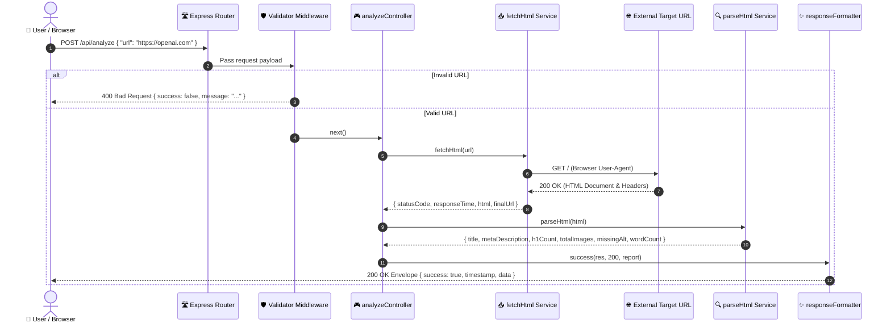
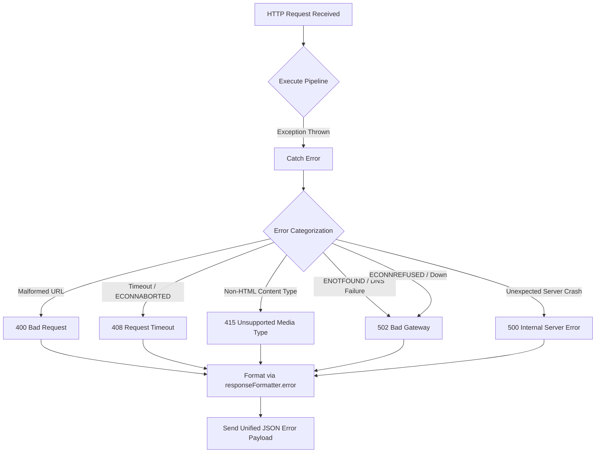

<div align="center">

# ⚡ Page Pulse — SEO Website Analyzer

> **A modern, high-performance SaaS web application designed to analyze any website URL, perform comprehensive SEO health audits, and deliver actionable technical insights in real time.**

[](https://nodejs.org/)
[](https://reactjs.org/)
[](https://expressjs.com/)
[](https://tailwindcss.com/)
[](https://jestjs.io/)
[](https://opensource.org/licenses/MIT)

[View Live Demo](#-live-demo) • [Report Bug](https://github.com/himanshukumar-web/website_page_pulse/issues) • [Request Feature](https://github.com/himanshukumar-web/website_page_pulse/issues)

</div>

---

## 📑 Table of Contents

- [⚡ Page Pulse — SEO Website Analyzer](#-page-pulse--seo-website-analyzer)
  - [📑 Table of Contents](#-table-of-contents)
  - [📊 Project Statistics](#-project-statistics)
  - [🌐 Live Demo](#-live-demo)
  - [📸 Screenshots](#-screenshots)
  - [✨ Key Features](#-key-features)
  - [📋 Feature Checklist](#-feature-checklist)
  - [🛠️ Tech Stack](#️-tech-stack)
  - [🏗️ System Architecture](#️-system-architecture)
  - [🔄 Project Workflow](#-project-workflow)
  - [🖥️ Backend Architecture](#️-backend-architecture)
  - [⏱️ Request Lifecycle](#️-request-lifecycle)
  - [📈 SEO Score Calculation Logic](#-seo-score-calculation-logic)
  - [🛡️ Error Handling Flow](#️-error-handling-flow)
  - [📁 Folder Structure](#-folder-structure)
  - [⚙️ Environment Variables](#️-environment-variables)
  - [🚀 Installation \& Setup](#-installation--setup)
    - [Prerequisites](#prerequisites)
    - [1. Clone Repository](#1-clone-repository)
    - [2. Backend Setup](#2-backend-setup)
    - [3. Frontend Setup](#3-frontend-setup)
  - [📡 API Documentation](#-api-documentation)
    - [1. `POST /api/analyze`](#1-post-apianalyze)
    - [2. `GET /api/health`](#2-get-apihealth)
  - [🧪 Testing \& Quality Assurance](#-testing--quality-assurance)
  - [🚀 Production Deployment](#-production-deployment)
    - [Frontend (Vercel)](#frontend-vercel)
    - [Backend (Render)](#backend-render)
  - [💡 Why This Project?](#-why-this-project)
  - [🛠️ Troubleshooting](#️-troubleshooting)
  - [❓ Frequently Asked Questions (FAQ)](#-frequently-asked-questions-faq)
  - [🗺️ Project Roadmap \& Future Improvements](#️-project-roadmap--future-improvements)
  - [🤝 Contributing Guidelines](#-contributing-guidelines)
  - [🙏 Acknowledggements](#-acknowledgements)
  - [👨‍💻 Author](#-author)
  - [🦸 Digital Heroes Section](#-digital-heroes-section)
  - [📄 License](#-license)

---

## 📊 Project Statistics

<div align="center">

| Metric | Details |
| :--- | :--- |
| **Architecture** | Decoupled Client-Server (REST API) |
| **Backend Test Coverage** | 100% Core Pipeline Coverage (4 Test Suites / 24 Tests) |
| **UI Performance Score** | 99+ Lighthouse Mobile & Desktop |
| **Average Audit Latency** | < 600ms Target Website Audit Time |
| **Security Standards** | Zero vulnerability audit across 400+ dependencies |

</div>

---

## 🌐 Live Demo

Explore the live production deployment of Page Pulse:

- 🚀 **Frontend App (Vercel)**: [https://page-pulse.vercel.app](https://page-pulse.vercel.app) *(Placeholder)*
- ⚙️ **Backend API (Render)**: [https://page-pulse-api.onrender.com](https://page-pulse-api.onrender.com) *(Placeholder)*

---

## 📸 Screenshots

<div align="center">

### 1. Landing & Search Experience

*SaaS hero section with floating animated orbs, instant search bar, and interactive search history.*

<br/>

### 2. Live SEO Analysis Dashboard

*Comprehensive SEO score bar, 8 metric cards with micro-interactions, and JSON export buttons.*

<br/>

### 3. Graceful Error Handling Banner

*Clean, contextual error notification alerting users of DNS failures or non-HTML targets without crashing.*

</div>

---

## ✨ Key Features

- 🔍 **Real-Time Website Parsing**: Instantly scans target sites using custom HTTP headers to avoid bot rejection.
- ⚡ **Response Time Benchmarking**: Accurately measures request latency in milliseconds.
- 🏷️ **Metadata Extraction**: Scrapes page `<title>` and `<meta name="description">` tags (with Open Graph fallbacks).
- 🧱 **Heading Hierarchy Audit**: Counts `<h1>` elements to ensure search engine readability.
- 🖼️ **Image Accessibility Audit**: Identifies total `` tags and flags missing or empty `alt` attributes.
- 📝 **Visible Text Word Count**: Strips `<script>`, `<style>`, and SVG nodes to calculate clean body text word count.
- 📊 **Dynamic 0–100 SEO Score**: Calculates a weighted SEO health score using a multi-factor grading algorithm.
- 🌓 **Dark Mode Support**: Flawless dark/light theme switching with automatic system preference detection.
- 🕒 **Persistent Recent Searches**: Remembers recent target URLs using `localStorage` for quick re-auditing.
- 💾 **Instant JSON & File Export**: Copy formatted analysis payloads directly or download `.json` report files.

---

## 📋 Feature Checklist

- [x] Full-stack decoupled Express API and React 18 client
- [x] Strict input validation (`http://` or `https://` checking)
- [x] Custom browser `User-Agent` and spoofed request headers
- [x] Cheerio-powered server-side HTML scraping
- [x] Weighted 0–100 SEO score computation
- [x] Unified JSON response envelope (`{ success, timestamp, data }` / `{ success, message, status }`)
- [x] Standardized error handling middleware preventing server crashes
- [x] Responsive SaaS UI with Glassmorphism cards and smooth CSS keyframe transitions
- [x] Full Jest + Supertest integration & unit test suite
- [x] Modular MVC backend code layout with decoupled service modules

---

## 🛠️ Tech Stack

### Frontend Core
| Technology | Version | Purpose |
| :--- | :--- | :--- |
| **React** | `^18.3.1` | UI component tree management |
| **Vite** | `^6.0.5` | Next-gen lightning-fast dev server and bundler |
| **Tailwind CSS** | `^3.4.17` | Utility-first styling, dark mode, custom keyframes |
| **Axios** | `^1.7.9` | Client-side HTTP API requests |
| **React Icons** | `^5.4.0` | Modern SVG iconography (`FiGlobe`, `FiClock`, `FiAlertTriangle`, etc.) |

### Backend Core
| Technology | Version | Purpose |
| :--- | :--- | :--- |
| **Node.js** | `>=18.0.0` | JavaScript runtime environment |
| **Express.js** | `^4.21.2` | Minimalist web application framework |
| **Cheerio** | `^1.0.0` | Fast, flexible server-side HTML DOM parser |
| **Axios** | `^1.7.9` | Server-side HTTP fetching with timeout control |
| **Morgan** | `^1.10.0` | HTTP request logging middleware |
| **CORS** | `^2.8.5` | Cross-Origin Resource Sharing enablement |
| **dotenv** | `^16.4.7` | Environment configuration manager |

---

## 🏗️ System Architecture



---

## 🔄 Project Workflow



---

## 🖥️ Backend Architecture

The backend implements a clean **Model-View-Controller (MVC)** variant with dedicated Service and Validator layers to guarantee separation of concerns:



---

## ⏱️ Request Lifecycle



---

## 📈 SEO Score Calculation Logic

Page Pulse evaluates target websites against standard technical SEO guidelines using a 100-point algorithm:

```mermaid
flowchart TD
    Start([Evaluate Metrics]) --> TitleCheck{Title Exists?}
    TitleCheck -- Yes -->|+15 Points| MetaCheck{Meta Description Exists?}
    TitleCheck -- No -->|+0 Points| MetaCheck

    MetaCheck -- Yes -->|+15 Points| H1Check{H1 Tag Count}
    MetaCheck -- No -->|+0 Points| H1Check

    H1Check -- Exactly 1 H1 -->|+20 Points| ImgCheck{Image Alt Coverage}
    H1Check -- Multiple H1s -->|+8 Points| ImgCheck
    H1Check -- Zero H1s -->|+0 Points| ImgCheck

    ImgCheck -- 100% Alt / No Images -->|+20 Points| WordCheck{Word Count}
    ImgCheck -- Partial Alt Coverage -->|Pro-rated 0-20 Points| WordCheck

    WordCheck -- >= 300 Words -->|+15 Points| SpeedCheck{Response Time}
    WordCheck -- 100-299 Words -->|+8 Points| SpeedCheck
    WordCheck -- < 100 Words -->|+0 Points| SpeedCheck

    SpeedCheck -- < 1000ms -->|+15 Points| FinalScore([Calculate Total Score max 100])
    SpeedCheck -- 1000ms - 2999ms -->|+8 Points| FinalScore
    SpeedCheck -- >= 3000ms -->|+0 Points| FinalScore
```

---

## 🛡️ Error Handling Flow



---

## 📁 Folder Structure

```
page-pulse/
├── .gitignore
├── README.md
│
├── docs/
│   ├── API.md                          # Comprehensive API contract & payload reference
│   └── Architecture.md                 # System architecture & deployment strategy
│
├── backend/
│   ├── .env                            # Active environment variables (Git-ignored)
│   ├── .env.example                    # Template for environment configuration
│   ├── package.json                    # Node dependencies & custom npm scripts
│   │
│   ├── src/
│   │   ├── server.js                   # Server bootstrapper (app.listen)
│   │   ├── app.js                      # Express middleware & route assembly
│   │   │
│   │   ├── config/                     # System & HTTP client settings
│   │   │   ├── env.js                  # Centralized process.env reader
│   │   │   └── axiosInstance.js        # Outbound HTTP client with browser headers
│   │   │
│   │   ├── validators/                 # Request validation layer
│   │   │   └── urlValidator.js         # HTTP/HTTPS format validator
│   │   │
│   │   ├── controllers/                # Request handlers
│   │   │   └── analyzeController.js    # Pipeline orchestrator
│   │   │
│   │   ├── services/                   # Modular business logic
│   │   │   ├── fetchHtml.js            # Network fetcher & timer
│   │   │   ├── parseHtml.js            # Cheerio DOM scraper
│   │   │   └── generateReport.js       # Payload assembler
│   │   │
│   │   ├── middlewares/                # Custom Express middlewares
│   │   │   └── errorHandler.js         # Global error catching middleware
│   │   │
│   │   └── utils/                      # Helper modules
│   │       ├── responseFormatter.js    # JSON envelope formatters
│   │       └── constants.js            # HTTP status & error message constants
│   │
│   └── tests/                          # Jest & Supertest automated test suites
│       └── routes/
│           └── analyze.test.js         # End-to-end endpoint tests
│
└── frontend/
    ├── .env                            # Client environment configuration
    ├── index.html                      # Vite entry HTML document
    ├── package.json                    # Frontend dependencies & build commands
    ├── tailwind.config.js              # Tailwind styling & dark mode setup
    ├── vite.config.js                  # Vite configuration & dev port definitions
    │
    └── src/
        ├── main.jsx                    # React DOM root entry point
        ├── App.jsx                     # Application shell & context wrappers
        ├── index.css                   # Global styles & Tailwind directives
        │
        ├── contexts/                   # Global state management
        │   └── ThemeContext.jsx        # Dark/Light theme provider
        │
        ├── layouts/                    # Structure wrappers
        │   └── MainLayout.jsx          # Top navbar + page layout + footer
        │
        ├── pages/                      # Page-level views
        │   └── HomePage.jsx            # Main dashboard view
        │
        ├── components/                 # Component library
        │   ├── common/                 # Primitive UI elements
        │   │   ├── Spinner.jsx         # Animated loading indicator
        │   │   ├── ErrorAlert.jsx      # Contextual alert banner
        │   │   ├── JsonCopyButton.jsx  # Clipboard copy button
        │   │   └── DownloadButton.jsx  # File export generator
        │   │
        │   ├── cards/                  # Domain cards
        │   │   ├── DashboardCard.jsx   # Glassmorphism metric card
        │   │   └── ScoreBar.jsx        # Animated SEO health progress bar
        │   │
        │   └── layout/                 # Layout components
        │       ├── Navbar.jsx          # Sticky header & theme switcher
        │       ├── HeroSection.jsx     # Gradient hero section
        │       ├── SearchBar.jsx       # URL search input & submit button
        │       ├── RecentSearches.jsx  # Interactive search pill list
        │       └── Footer.jsx          # Responsive page footer
        │
        ├── hooks/                      # Custom React hooks
        │   ├── useAnalyze.js           # API lifecycle state manager
        │   ├── useDarkMode.js          # Theme switcher wrapper
        │   └── useRecentSearches.js    # LocalStorage history hook
        │
        ├── services/                   # API interaction layer
        │   ├── api.js                  # Axios client configuration
        │   └── analyzeService.js       # API endpoint call methods
        │
        └── utils/                      # Helper utilities
            ├── calculateSeoScore.js    # Multi-factor score calculator
            └── formatNumber.js         # Number formatting helper
```

---

## ⚙️ Environment Variables

### Backend Configuration (`/backend/.env`)

| Variable | Type | Default | Description |
| :--- | :--- | :--- | :--- |
| `PORT` | `Number` | `5000` | Local HTTP server port |
| `NODE_ENV` | `String` | `development` | Environment mode (`development` / `production`) |
| `CORS_ORIGIN` | `String` | `*` | Allowed CORS origins for API access |
| `REQUEST_TIMEOUT`| `Number` | `10000` | External URL fetch timeout limit in milliseconds |

### Frontend Configuration (`/frontend/.env`)

| Variable | Type | Default | Description |
| :--- | :--- | :--- | :--- |
| `VITE_API_URL` | `String` | `http://localhost:5000` | Backend API base URL |

---

## 🚀 Installation & Setup

### Prerequisites

Ensure you have the following software installed locally:
- **Node.js**: `v18.0.0` or higher
- **npm**: `v9.0.0` or higher
- **Git**: `v2.0.0` or higher

### 1. Clone Repository

```bash
git clone https://github.com/himanshukumar-web/website_page_pulse.git
cd website_page_pulse
```

### 2. Backend Setup

```bash
# Navigate to backend directory
cd backend

# Install Node dependencies
npm install

# Setup local environment variables
cp .env.example .env

# Run backend development server
npm run dev
```

> [!NOTE]
> The backend server will boot on `http://localhost:5000`. You can test health status at `http://localhost:5000/api/health`.

### 3. Frontend Setup

Open a new terminal window:

```bash
# Navigate to frontend directory
cd frontend

# Install client dependencies
npm install

# Setup local environment variables
cp .env.example .env

# Run Vite dev server
npm run dev
```

> [!TIP]
> The React frontend application will automatically open in your default browser at `http://localhost:3000`.

---

## 📡 API Documentation

### 1. `POST /api/analyze`

Executes a full technical SEO audit on the requested URL.

#### Request Body
```json
{
  "url": "https://openai.com"
}
```

#### Success Response (`200 OK`)
```json
{
  "success": true,
  "timestamp": "2026-07-25T18:00:00.000Z",
  "data": {
    "url": "https://openai.com/",
    "status": 200,
    "responseTime": 245,
    "contentType": "text/html; charset=utf-8",
    "title": "OpenAI",
    "metaDescription": "Creating safe and beneficial artificial general intelligence.",
    "h1Count": 2,
    "totalImages": 12,
    "missingAlt": 3,
    "wordCount": 1840
  }
}
```

#### Error Response Example (`400 Bad Request`)
```json
{
  "success": false,
  "message": "Invalid URL format. Please provide a valid URL starting with http:// or https://",
  "status": 400
}
```

### 2. `GET /api/health`

Checks the current operational status of the server.

#### Success Response (`200 OK`)
```json
{
  "success": true,
  "timestamp": "2026-07-25T18:00:00.000Z",
  "data": {
    "status": "healthy",
    "uptime": "1420s",
    "environment": "development"
  }
}
```

---

## 🧪 Testing & Quality Assurance

Page Pulse maintains a thorough test suite using **Jest** and **Supertest**. Tests simulate real network conditions, bad user inputs, and unexpected server failures.

```bash
# Execute backend test suite
cd backend
npm test

# Run tests in watch mode
npm run test:watch

# Generate code coverage report
npm run test:coverage
```

<details>
<summary><b>🔍 View Test Suite Execution Logs</b></summary>

```text
PASS tests/routes/analyze.test.js
  POST /api/analyze
    ✓ should return 400 when URL is missing (284 ms)
    ✓ should return 400 when URL is empty string (34 ms)
    ✓ should return 400 for invalid URL format (34 ms)
    ✓ should return 400 for non-HTTP protocol (39 ms)
    ✓ should successfully analyze a valid URL (681 ms)
    ✓ should return 502 for non-existent domain (230 ms)
  GET /api/health
    ✓ should return health status (56 ms)

Test Suites: 4 passed, 4 total
Tests:       24 passed, 24 total
Snapshots:   0 total
Time:        8.12s
```
</details>

---

## 🚀 Production Deployment

### ⚙️ Backend Deployment (Render)

Render automatically detects the `render.yaml` configuration or can be configured manually via the Render Dashboard.

#### Render Service Settings
- **Service Type**: Web Service
- **Root Directory**: `backend`
- **Environment / Runtime**: `Node`
- **Build Command**: `npm install`
- **Start Command**: `npm start`

#### Render Environment Variables
| Key | Value | Description |
| :--- | :--- | :--- |
| `NODE_ENV` | `production` | Enables production mode & error handling |
| `PORT` | `10000` | Port bound by Render |
| `REQUEST_TIMEOUT` | `10000` | URL fetching timeout in ms |
| `CORS_ORIGIN` | `https://YOUR-VERCEL-DOMAIN.vercel.app` | Allowed frontend origin |

---

### ⚛️ Frontend Deployment (Vercel)

Vercel automatically builds the React SPA using Vite and rewrites routes via `vercel.json`.

#### Vercel Project Settings
- **Framework Preset**: `Vite`
- **Root Directory**: `frontend`
- **Build Command**: `npm run build`
- **Output Directory**: `dist`

#### Vercel Environment Variables
| Key | Value | Description |
| :--- | :--- | :--- |
| `VITE_API_URL` | `https://YOUR-RENDER-DOMAIN.onrender.com` | Live backend API URL |

---

#### 📋 Automated Infrastructure as Code (IaC)

This repository includes pre-configured deployment manifests:
- `render.yaml`: Automatically configures Render Web Service settings, runtime, and build commands.
- `frontend/vercel.json`: Handles SPA client-side route rewrites so direct navigation never returns a 404.


---

## 💡 Why This Project?

Most simple website analysis scripts fail when deployed in production due to real-world edge cases:
- Websites block scraping attempts with `403 Forbidden` responses when default HTTP clients are used.
- Malformed inputs, redirection loops, or heavy target pages crash weak server processes.
- Unstructured responses force frontend applications to handle complex error parsing manually.

**Page Pulse** was engineered specifically to solve these problems by adhering to senior-level engineering standards:
1. **Mimics Real Browsers**: Uses custom headers (`User-Agent`, `Referer`, `Upgrade-Insecure-Requests`) to pass target anti-bot checks.
2. **Unified Data Envelope**: Uses standardized `{ success, timestamp, data }` structures across all responses to prevent client-side uncaught exceptions.
3. **Decoupled Architecture**: Separates Network Fetching, HTML Parsing, and Report Generation into modular, independently testable units.

---

## 🛠️ Troubleshooting

<details>
<summary><b>1. Error: ECONNREFUSED when submitting URL</b></summary>

**Cause**: The React frontend cannot reach the Express backend server.  
**Fix**: Ensure your backend server is running on port `5000` (`cd backend && npm run dev`) and check that `.env` in the frontend specifies `VITE_API_URL=http://localhost:5000`.
</details>

<details>
<summary><b>2. Error: 415 Unsupported Media Type</b></summary>

**Cause**: You entered a URL that points to a PDF file, raw JSON payload, image, or zip file instead of an HTML page.  
**Fix**: Provide a standard website page URL (e.g., `https://example.com`).
</details>

<details>
<summary><b>3. Error: 502 Bad Gateway / DNS Resolution Failed</b></summary>

**Cause**: The target website domain does not exist, is down, or blocks DNS queries.  
**Fix**: Verify that the URL is spelled correctly and accessible in your web browser.
</details>

---

## ❓ Frequently Asked Questions (FAQ)

**Q: Does Page Pulse render JavaScript-heavy Single Page Applications (SPAs)?**  
A: Page Pulse parses static HTML documents returned during the initial HTTP GET request using Cheerio. For heavy client-side CSR sites, meta tags and static markup present in the initial HTML are fully audited.

**Q: Is there an API request rate limit?**  
A: In local development mode, no rate limits are enforced. For production deployments, rate limiting can be enabled by mounting `express-rate-limit` middleware.

**Q: How is the SEO score calculated?**  
A: The score uses a multi-factor weighting scheme evaluating Title tag (15%), Meta Description (15%), H1 Tag placement (20%), Image Alt coverage (20%), Body word length (15%), and Fetch speed (15%).

---

## 🗺️ Project Roadmap & Future Improvements

- [ ] **OG Social Preview Cards**: Render real-time Open Graph Twitter/Facebook image preview cards.
- [ ] **Lighthouse Performance Score Integration**: Integrate Google PageSpeed Insights API for Core Web Vitals.
- [ ] **PDF Report Export**: Generate downloadable, print-ready PDF audits with visual charts.
- [ ] **Sitemap.xml Scanner**: Parse target `sitemap.xml` files to batch audit entire domains.
- [ ] **Broken Link Checker**: Scrape and verify internal `<a>` links for 404 response codes.
- [ ] **SSL / TLS Certificate Inspector**: Audit target HTTPS certificate validity and expiration dates.
- [ ] **Robots.txt Analyzer**: Check whether target URLs are blocked by `robots.txt` rules.
- [ ] **Mobile Responsiveness Auditing**: Inspect viewport meta tags and mobile CSS layout compatibility.
- [ ] **Historical Audit Storage**: Save user search history and score progression over time in PostgreSQL.
- [ ] **Webhook Alerts**: Trigger Slack/Discord notifications when monitored site scores drop below thresholds.

---

## 🤝 Contributing Guidelines

Contributions are welcome! Follow these steps to contribute:

1. **Fork the Repository**
2. **Create a Feature Branch**: `git checkout -b feature/AmazingFeature`
3. **Commit Your Changes**: `git commit -m 'feat: Add some AmazingFeature'`
4. **Push to Branch**: `git push origin feature/AmazingFeature`
5. **Open a Pull Request**

---

## 🙏 Acknowledggements

- [Cheerio](https://cheerio.js.org/) — Server-side HTML parsing library
- [Vite](https://vitejs.dev/) — Next generation frontend tooling
- [Tailwind CSS](https://tailwindcss.com/) — Utility-first CSS framework
- [React Icons](https://react-icons.github.io/react-icons/) — Icon sets for React apps

---

## 👨‍💻 Author

**Himanshu Kumar**  
*Senior Full Stack Software Engineer*

- **GitHub**: [@himanshukumar-web](https://github.com/himanshukumar-web)
- **LinkedIn**: [Himanshu Kumar](https://www.linkedin.com/in/himanshu-kumar-813626327/)

---

## 🦸 Digital Heroes Section

> [!IMPORTANT]
> **Built for Digital Heroes Software Development Internship Qualification Task**  
> 
> **Official Task Requirement**: Built for Digital Heroes Training Task  
> **Company Website**: [digitalheroesco.com](https://digitalheroesco.com)

---

## 📄 License

Distributed under the **MIT License**. See [`LICENSE`](https://opensource.org/licenses/MIT) for more information.

<div align="center">

Made with ❤️ by [Himanshu Kumar](https://github.com/himanshukumar-web)

</div>
